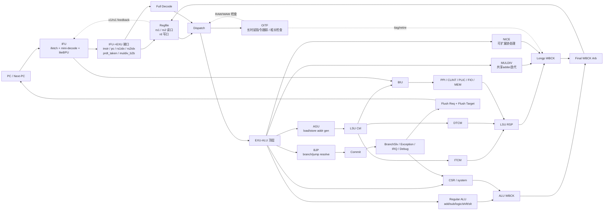

基于这份 RTL，E203 的数据通路可以概括成一句话：它是一个“**两级主流水 + 长时延旁路/OITF 记分牌**”的轻量核。主干在 e203_core.v (line 376) 里很清楚：IFU -> EXU -> LSU/BIU，其中 IFU 和 EXU 是主流水，LSU/乘除/NICE 这类长时延操作通过 OITF 挂出去再按序回收。当前配置里启用了 32 个 GPR、ITCM、DTCM、NICE、共享乘除法器，且 OITF 深度是 2，见 config.v (line 40) 和 e203_defines.v (line 137), e203_defines.v (line 173), e203_defines.v (line 206), e203_defines.v (line 282), e203_defines.v (line 779)。

**主数据流**

```
PC/取指  -> IFU(mini-decode + lite BPU + ICB取指)  -> EXU(寄存器堆读 + 完整译码 + dispatch)  -> ALU共享数据通路     -> 普通ALU: 直接写回     -> BJP: 分支解析/链接地址     -> AGU: 形成访存地址并发给LSU     -> MULDIV/NICE: 进入长时延路径  -> WBCK/COMMIT  -> flush/next-PC 回到 IFU 
```

IFU 不只是“取指”，还提前做了 mini-decode 和轻量预测。litebpu 对 JAL/JALR/后向分支 直接给出预测方向和目标地址，e203_ifu_litebpu.v (line 84)；ifetch 用这个结果、flush 请求和顺序 PC 一起生成下一个取指地址，e203_ifu_ifetch.v (line 441)。一个很典型的省面积做法是：EXU flush 时并不总是直接传新 PC，而是把 add_op1/add_op2 送回 IFU，让 IFU 复用自己的 PC 加法器，e203_exu_commit.v (line 307)。

EXU 这边先读寄存器堆，再完整译码，再 dispatch。e203_exu_regfile.v (line 61) 表明 x0 硬连 0，普通寄存器由写回口更新；x1 还专门输出给 IFU 做 JALR x1 的快速预测。e203_exu_disp.v (line 145) 的注释基本就是这颗核的数据相关哲学：因为是两级流水，普通 ALU 指令不会形成复杂的 ALU-ALU 相关，真正要管的是“长时延指令和后续指令”的 RAW/WAW，所以 dispatch 只要盯住 OITF 和记分牌即可，e203_exu_disp.v (line 176)。

**执行通路的核心特点**
ALU 不是只服务“普通算术”，而是一个**共享数据通路**。在 e203_exu_alu.v (line 243) 可以看到，AGU / MULDIV / NICE 都会把自己标记成 longpipe；在 e203_exu_alu_dpath.v (line 29) 可以看到，普通 ALU、BJP、AGU、MULDIV 共用一套 adder/compare/logic/shifter 资源。也就是说，E203 的“数据通路设计”重点不是堆很多并行执行单元，而是**让多个功能复用一条窄而深度可控的数据通路**。

这条共享通路分成几类结果：

- 普通 ALU 结果直接写回，e203_exu_alu_rglr.v (line 110)
- 分支/跳转用同一套比较器和加法器算跳转目标及比较结果，e203_exu_alu_bjp.v (line 98)
- 访存地址由 AGU 用 ALU 共享加法器生成，再发 ICB 请求，e203_exu_alu_lsuagu.v (line 493), e203_exu_alu_lsuagu.v (line 649)
- 乘除法也复用 ALU adder，属于典型“省门数优先”的实现，e203_exu_alu_muldiv.v (line 492)

**长时延/访存为什么能挂在两级流水上**
答案就是 OITF。它本质上是一个按序分配、按序退休的小表，记录尚未完成的长时延指令目的寄存器和 PC，e203_exu_oitf.v (line 133), e203_exu_oitf.v (line 156)。dispatch 时只要发现新指令的 rs1/rs2/rd 与 OITF 中未完成项冲突，就停。这样就不需要复杂旁路和乱序唤醒逻辑。

LSU 通路也很干净：AGU 先产生 ICB 请求，lsu_ctrl 再按地址把请求路由到 ITCM / DTCM / BIU，e203_lsu_ctrl.v (line 564)。返回数据如果是“需要回到 AGU 的中间结果”就回 AGU，否则直接进入 LSU 写回口，e203_lsu_ctrl.v (line 913)。最终写回仲裁里，longp 优先于 alu，e203_exu_wbck.v (line 67)。

BIU 则负责把 IFU 和 LSU 两路外部访问合并并再按地址拆给 PPI/CLINT/PLIC/FIO/MEM。这里 LSU 优先级高于 IFU，e203_biu.v (line 301)；而 IFU 如果误取到外设区，会直接得到一个错误响应而不是去真的访问外设，e203_biu.v (line 836), e203_biu.v (line 941)。

如果你想继续，我下一步可以直接给你画一张“**E203 数据通路框图**”，或者继续深入拆 IFU/分支预测、LSU/访存状态机、CSR/异常提交 其中一块。


下面这张图对应你这份 E203 RTL 的实际结构，按“主流水 + 长时延旁路 + 存储系统”来画：




可以这样理解这张图：

1. 主流水其实很短。
   IFU -> EXU 是主干，EXU 内部再完成“读寄存器、译码、派发、执行、提交”。
2. E203 的核心不是很多并行执行单元，而是“共享数据通路”。
   Regular ALU / BJP / AGU / MULDIV 大量复用同一套 ALU datapath，所以面积小，但控制会更精细。
3. 长时延操作不堵死整个核心，而是挂到 OITF。
   load/store 返回、mul/div、NICE 这些结果都走 Longp WBCK，最后再和普通 ALU 写回一起仲裁。
4. 分支和异常通过提交链路回到 IFU。
   Commit -> BranchSlv/Exception -> Flush -> Next-PC 是控制回环，也是你读代码时最该单独拎出来看的那条线。

如果你愿意，我下一条可以继续给你画一张“更细的 EXU 内部数据通路图”，把 Dispatch / OITF / ALU / WBCK /